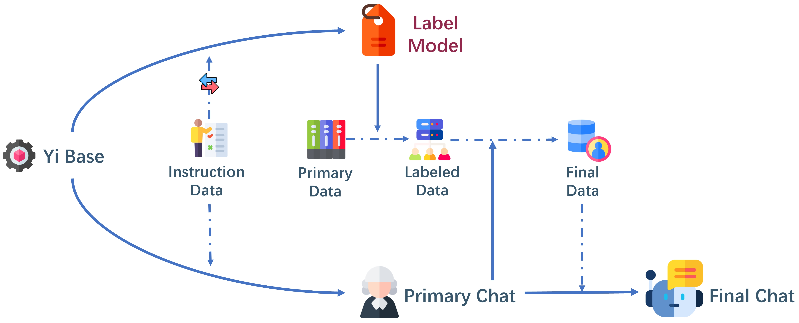

<div align="center">
    
    
</div>


# Kun: Answer Polishment Saves Your Time for Using Intruction Backtranslation on Self-Alignment

## Introduction

Inspired by Meta's mid-year paper "Self-Alignment with Instruction Backtranslation," our project embarks on an innovative approach to enhance language model training using a novel data augmentation paradigm. This method, rooted in the principles of self-alignment, involves a meticulous process of selecting, refining, and employing high-quality [instructional data](https://huggingface.co/datasets/m-a-p/COIG-Kun) to fine-tune language models.

## Updates

- **[2023.12.04]** 🎉 Released version 0.1 of the dataset.

## Methodology

Our approach closely follows the self-alignment method described by Meta, with adaptations to optimize the process:

1. **Seed Data Selection and Model Training**: Initially, appropriate seed data are selected and inverted to train a Label Model on a base model(Yi Base). Concurrently, using the same seed data, a Primary Chat model is trained following the Supervised Fine-Tuning (SFT) method typical of chat models.

3. **Labeling Unlabeled Data**: The Label Model is then used to annotate preliminarily cleansed Primary data. Cleansing involves filtering based on perplexity (ppl) and length, discarding data exceeding 512 tokens.

4. **Instruction Data Generation**: Post-annotation, we obtain our first version of Labeled data. Unlike the original project where both instruction and output data pairs are fed into Primary Chat Model for scoring, our replication revealed limitations in Primary Chat's ability to discern high-quality instructions. We innovated by scoring only the instruction component, effectively filtering out noise and selecting high-quality instructions.

5. **Output Data Refinement**: Upon manual inspection, we identified a mismatch between the Primary Data (used as output) and the standard requirements for output in instruction data. To address this, we introduced an additional step: refining the output data. Using Primary Chat's capabilities, the output (originally unlabeled data) is adjusted according to the instructions, making it more suitable as output for the instruction data.

6. **Framework Completion**: Our methodology concludes with the acquisition of a substantial volume of instructional data, achieved with minimal resource expenditure.




## Installation and Usage Instructions

### Installation
To install the project, clone the repository from GitHub:
```
git clone https://github.com/Zheng0428/COIG-Kun.git
```

### Usage
After cloning the repository, follow these steps to use the framework:

1. **Navigate to the Project Directory**:
   Change to the directory where the repository has been cloned:
   ```
   cd COIG-Kun
   ```

2. **Move to the Scripts Directory**:
   Change to the scripts directory within the project folder:
   ```
   cd scripts
   ```

3. **Execute the Pipeline Script**:
   Run the pipeline script with the required parameters:
   ```
   sh pipline.sh label_model_path point_model_path answer_model_path data_path output_path
   ```

   - `label_model_path`: Path to the instruction generation model.
   - `point_model_path`: Path to the scoring model.
   - `answer_model_path`: Path to the response correction model.
   - `data_path`: Directory where the raw, unlabeled data is stored.
   - `output_path`: Directory where the generated data will be stored.

Make sure that each path is correctly specified and points to the respective model or data directory in your file system.

## Training Process

This section provides a detailed explanation of the training process for the Label Model, Answer Model, and Point Model from a base model, using high-quality seed data.

### Label Model Training
- **Huggingface** : [Label Model](https://huggingface.co/m-a-p/Kun-LabelModel)
- **Data Preparation**: Utilize approximately ten thousand high-quality seed instructions. The responses to these instructions are used as outputs, and the instructions themselves as inputs.
- **Model Configuration**: Fine-tune the Yi-34B base model using the prepared data.
- **Training Parameters**:
  - Epochs: Six
  - Learning Rate: 1e-5

### Answer Model / Point Model Training
- **Data Preparation**: Employ the same set of ten thousand seed instruction data as used for the Label Model.
- **Model Configuration**: Positive fine-tuning of the Yi-34B base model is performed with the seed instruction data.
- **Training Parameters**:
  - Epochs: Four
  - Learning Rate: 1e-5

**Note**: The seed data comprises high-quality instructional data, meticulously curated to ensure the effectiveness of the training process.

## Implementation in Scripts
The training process for each model is embedded within specific scripts in the server's repository. Users are encouraged to adjust the training parameters based on their specific requirements and computational resources.

## Results

Our project has successfully generated high-quality instructional data through a novel, cost-effective approach that eschews traditional distillation methods. By refining our data selection and processing techniques, we have produced a large volume of valuable instructional data. This approach focuses on enhancing the quality and applicability of the data, which is essential for improving the performance of language models. Our method demonstrates the potential to significantly advance the field of language model training by providing superior instructional data with minimal resource expenditure.

## Contributions

This project contributes to the field of language model training by:

- Proposing a novel approach to generate and refine instructional data.
- Demonstrating the effectiveness of selective scoring on instruction data for quality enhancement.
- Offering a resource-efficient methodology for data augmentation.
- Provision of a directly usable Chinese instruction generation model.

## Future Work

We plan to explore further refinements in data selection and scoring methods, aiming to enhance the quality of the generated instructional data even more. Additionally, adapting this methodology to other language models and contexts remains an area of interest.

## Citations

To cite our project in your work, please use the following BibTeX entry:

```bibtex
@misc{COIG-Kun,
  title={Kun: Answer Polishment Saves Your Time for Using Intruction Backtranslation on Self-Alignment},
  author={Tianyu, Zheng* and Shuyue, Guo* and Xingwei, Qu and Xinrun, Du and Wenhu, Chen and Jie, Fu and Wenhao, Huang and Ge, Zhang},
  year={2023},
  publisher={GitHub},
  journal={GitHub repository},
  howpublished={https://github.com/Zheng0428/COIG-Kun}
}
```

For referencing the Humpback model as described in "Self-Alignment with Instruction Backtranslation", use:

```bibtex
@article{li2023self,
  title={Self-alignment with instruction backtranslation},
  author={Li, Xian and Yu, Ping and Zhou, Chunting and Schick, Timo and Zettlemoyer, Luke and Levy, Omer and Weston, Jason and Lewis, Mike},
  journal={arXiv preprint arXiv:2308.06259},
  year={2023}
}
```

For referencing the datasets as described in "Kun", use:

```bibtex
@misc{he2023wanjuan,
   title={WanJuan: A Comprehensive Multimodal Dataset for Advancing English and Chinese Large Models}, 
   author={Conghui He and Zhenjiang Jin and Chao Xu and Jiantao Qiu and Bin Wang and Wei Li and Hang Yan and Jiaqi Wang and Dahua Lin},
   year={2023},
   eprint={2308.10755},
   archivePrefix={arXiv},
   primaryClass={cs.CL}
}
@misc{wei2023skywork,
   title={Skywork: A More Open Bilingual Foundation Model}, 
   author={Tianwen Wei and Liang Zhao and Lichang Zhang and Bo Zhu and Lijie Wang and Haihua Yang and Biye Li and Cheng Cheng and Weiwei Lü and Rui Hu and Chenxia Li and Liu Yang and Xilin Luo and Xuejie Wu and Lunan Liu and Wenjun Cheng and Peng Cheng and Jianhao Zhang and Xiaoyu Zhang and Lei Lin and Xiaokun Wang and Yutuan Ma and Chuanhai Dong and Yanqi Sun and Yifu Chen and Yongyi Peng and Xiaojuan Liang and Shuicheng Yan and Han Fang and Yahui Zhou},
   year={2023},
   eprint={2310.19341},
   archivePrefix={arXiv},
   primaryClass={cs.CL}
}
@article{YUAN202165,
   title = {WuDaoCorpora: A super large-scale Chinese corpora for pre-training language models},
   journal = {AI Open},
   volume = {2},
   pages = {65-68},
   year = {2021},
   issn = {2666-6510},
   doi = {https://doi.org/10.1016/j.aiopen.2021.06.001},
   url = {https://www.sciencedirect.com/science/article/pii/S2666651021000152},
   author = {Sha Yuan and Hanyu Zhao and Zhengxiao Du and Ming Ding and Xiao Liu and Yukuo Cen and Xu Zou and Zhilin Yang and Jie Tang},
   keywords = {Pre-trained language models, Chinese corpus, Transformer-XL},
}
```


